  

  <a href="https://github.com/Jake4ReaI?tab=repositories">Repositories</a>
  &nbsp;&nbsp;•&nbsp;&nbsp;
  <a href="https://jake4reai.github.io/Jake4ReaI/">Play</a>
  &nbsp;&nbsp;•&nbsp;&nbsp;
  <a href="#contributions">Contributions</a>

 

 

 

 

 

## Contributions

<picture>
  <source media="(prefers-color-scheme: dark)" srcset="https://raw.githubusercontent.com/Jake4ReaI/Jake4ReaI/output/github-contribution-grid-snake-dark.svg" />
  <source media="(prefers-color-scheme: light)" srcset="https://raw.githubusercontent.com/Jake4ReaI/Jake4ReaI/output/github-contribution-grid-snake.svg" />
  
</picture>

 

  <strong>Measure twice. Ship once.</strong>

  <a href="https://github.com/Jake4ReaI">github.com/Jake4ReaI</a>

